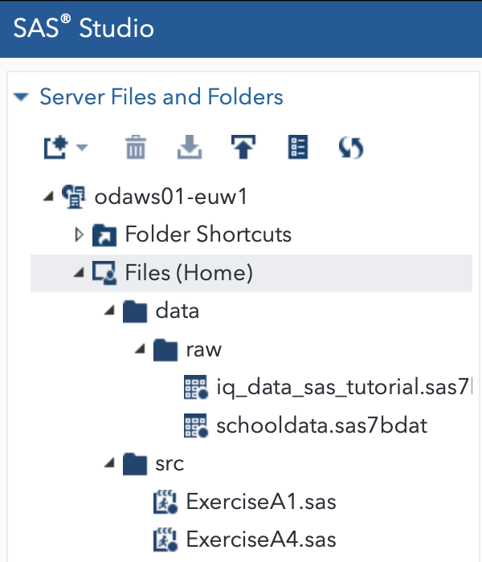

# Longitudinal Data Analysis Exercises

## Getting Started

This project's working branch is `main`, and it has the following directory structure:

```
[REPOSITORY-Name]
	├── LICENSE.md
	├── README.md
	├── data
	│   ├── raw
	│   └── processed
	├── docs
	│   └── support documentation, project descriptions, and images
	└── src
	    └── all executbale script files
```

## Running the App

1. Clone the project
	```bash
	git clone https://github.com/abroniewski/Longitudinal-Data-Analysis-Exercises.git
	```
2. Setup SAS account. This project used [SAS OnDemand for Academics](https://www.sas.com/en_us/software/on-demand-for-academics.html) with a free student license.
3. In SAS Studio, setup directory structure as shown below. Upload files from `data/raw` and `src` from repository into SAS.

 

4. Run the programs in SAS Studio

## Development

The goal of this project is to share learning from the Longitudinal Data Analysis course at Technical University Eindhoven (TU/e). The exercises completed follow the 2022 Q1 course offering. Some SAS programs will include more than what the exercises call for to support SAS exploration. Comments are included to help understand SAS specific requirements as well as theoretical application of variance analysis

## Authors

#### Adam Broniewski

* [GitHub](https://github.com/abroniewski)
* [LinkedIn](https://www.linkedin.com/in/abroniewski/)
* [Website](https://adambron.com)

## License

This project is open source software [licensed as MIT][license].

## Acknowledgments


[license]: https://github.com/abroniewski/LICENSE.md